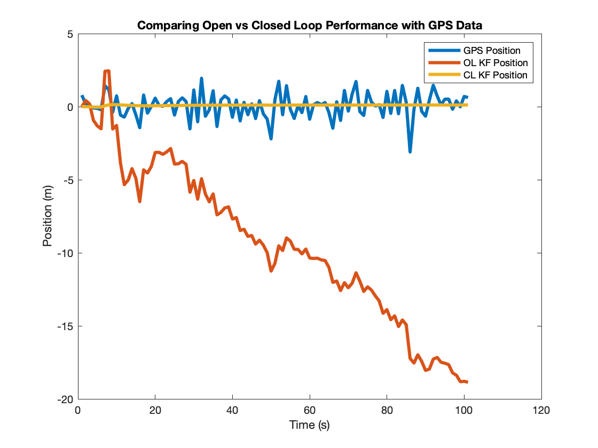

# Kalman Filters

## Overview 
Sensor fusion is a powerful processing framework that at its most fundamental level leverages multiple sources of information to produce an increasingly more reliable estimate than compared to any estimate that could be drawn by the same sources in isolation. Sensor fusion techniques are widly appled for robotic applications, especially for systems which require a high accuracy of state estimation. While there are a number of different algorithms, this walkthrough will focus on *kalman filters*. This project should serve to demonstrate just how useful kalman filters can be for multisensor systems, and provide an introductory understanding of their implimentation. 

## Basics 
Kalman Filters generally work by taking in a series of observations, their uncertainties, and a dynamical model of the states to produce a more accurate estimate of an unkonwn state that considers both the observed and expected behaviours. There are several sources that I used to understand kalman filters, that do a way better job of detailing them (far better than I could ever do), so I'll refer the readers to them. 

### References 
- [Fundamentals of Spacecraft Attitude Determination and Control](https://link.springer.com/book/10.1007/978-1-4939-0802-8)
- [Optimal Estimation of Dynamic Systems](https://www.routledge.com/Optimal-Estimation-of-Dynamic-Systems/Crassidis-Junkins/p/book/9781439839850)
- [Fundamentals of Kalman Filtering: A Practical Approach](https://arc.aiaa.org/doi/book/10.2514/4.102776)
- [Tracking and Kalman Filtering Made Easy](https://www.wiley.com/en-us/Tracking+and+Kalman+Filtering+Made+Easy-p-9780471184072)

## Basic Walkthrough 
To demonstrate the capabilities of a Kalman Filter, we'll walk through a simple example involving a stationary system (imagine a plane parked on a tarmac). Let's say you want to find the position (will only consider the simple 1D case now) of the system, and you have at your dispoal measurements from an INS (which provide accelerations) and position from a GPS system). 

### Uncorrected Position 
Trying the simplest thing first, lets look at the position estimates we get from the GPS and the INS. The GPS directly provides the position, but we'll need to integrate the accelerations from the INS to get position.

This clearly shows that these system can be very inaccurate on their own. Biases in the INS lead to inaccurate accelerations which propogate into the large errors in position. A stationary system should move 2km over an hour. Similarly, uncertainties in the GPS also produce a trajectory that indicates the system was in motion, even though it was not. Although depending on your application, the error tolerance of the GPS may be good enough, and in that case you could get by with just the GPS. But to show how handly kalman filters can be, let's look at the position estimates using an open and closed loop kalman filter. 

### Corrected Position 

The open loop trajectory, although better than the integrated INS position estimate, still doesn't correctly capture the behaviour of the system. The open loop kalman filter represents a case where a kalman filter is used to estimate the error in position and update the estimate of the true position, but for each iteration only the position obtained from integrating the INS data is used to determine the true position. However, in the closed loop case, each iteration updates up on the previous estimate of the postion. As a result, we get a trajectory that very closely matches the actual behaviour of the system! 
